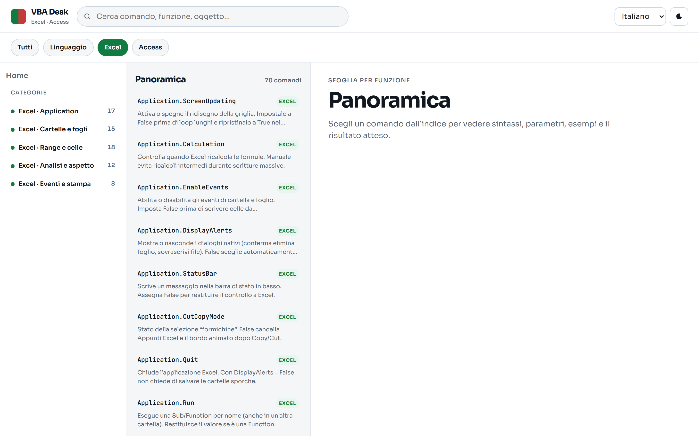
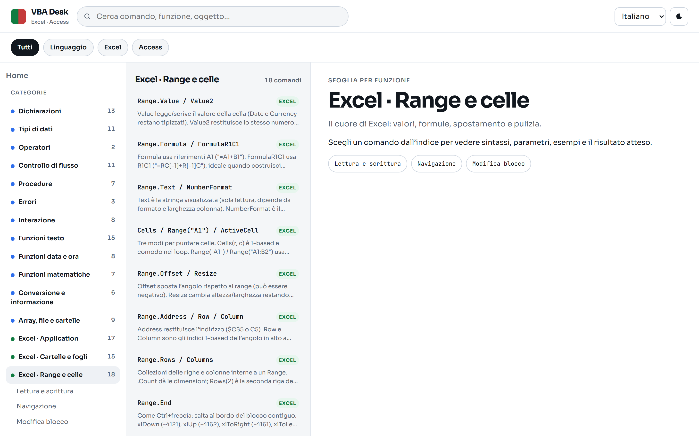
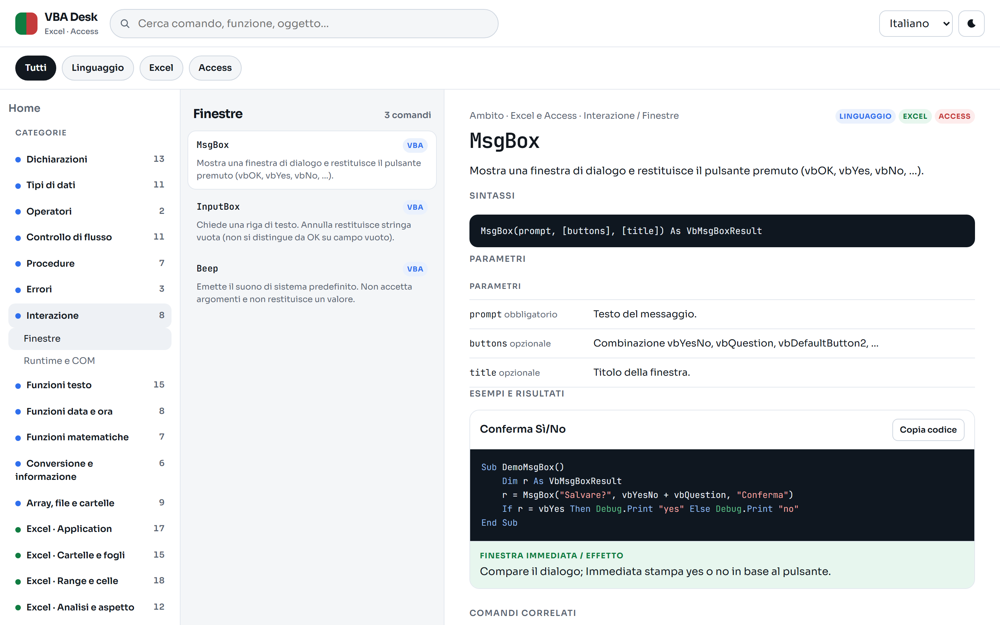
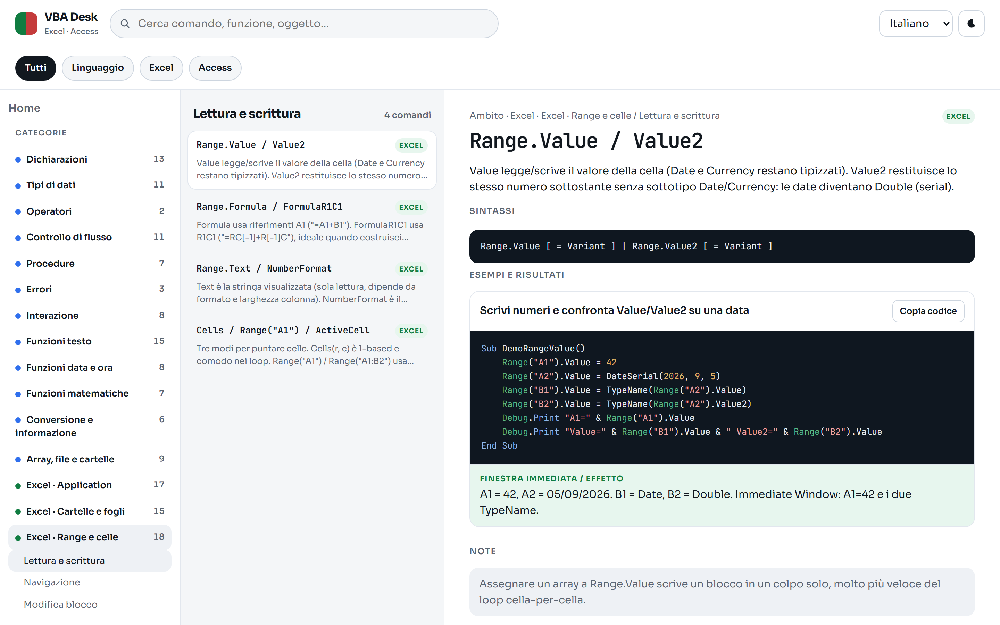
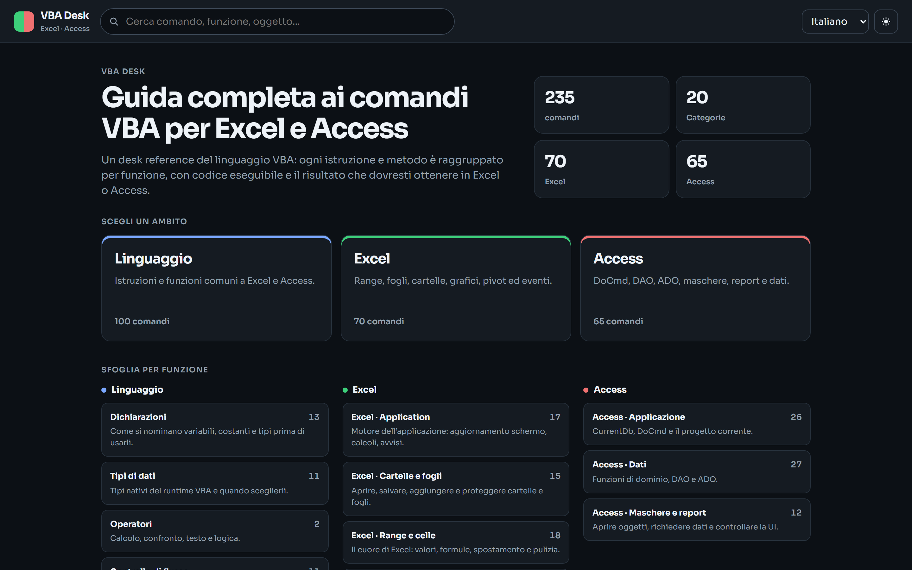

# VBA Desk

Guida completa ai comandi VBA per Excel e Access, in italiano, inglese, spagnolo, francese e tedesco.

Ogni comando ha sintassi, parametri, esempi copiabili e il risultato atteso. I comandi sono raggruppati per funzione (linguaggio, Excel, Access) e sotto-categorie.

## Screenshot

### Home


### Catalogo Excel



### Categoria Range e celle



### Scheda comando (MsgBox)



### Scheda comando Excel (Range.Value)



### Tema scuro



### Mobile


## Avvio

```bash
npm install
npm run dev
```

Apri l’URL mostrato da Vite (di solito `http://localhost:5173`).
